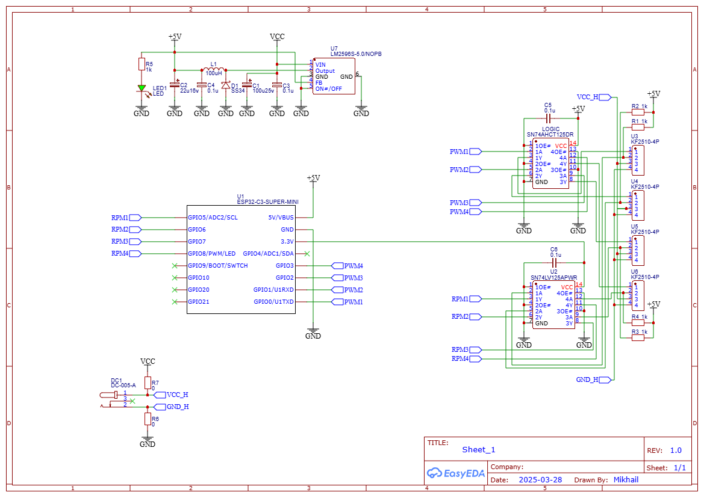
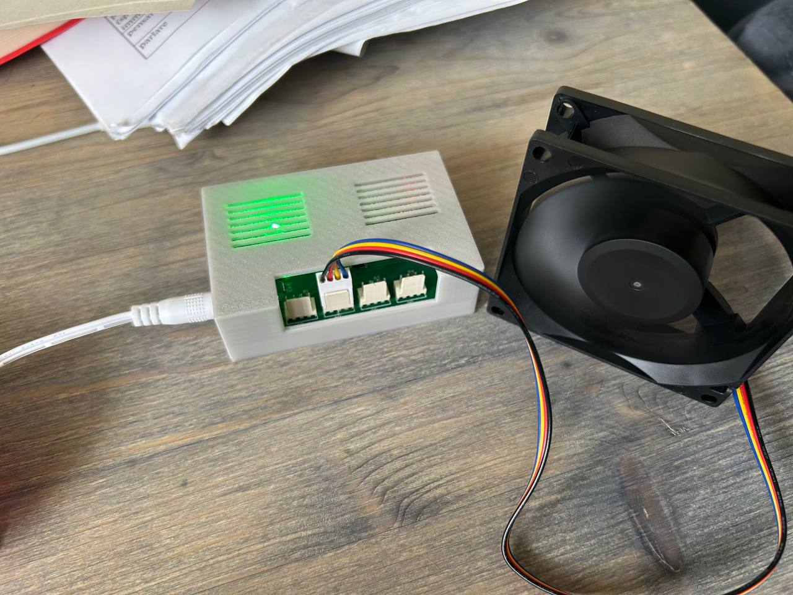
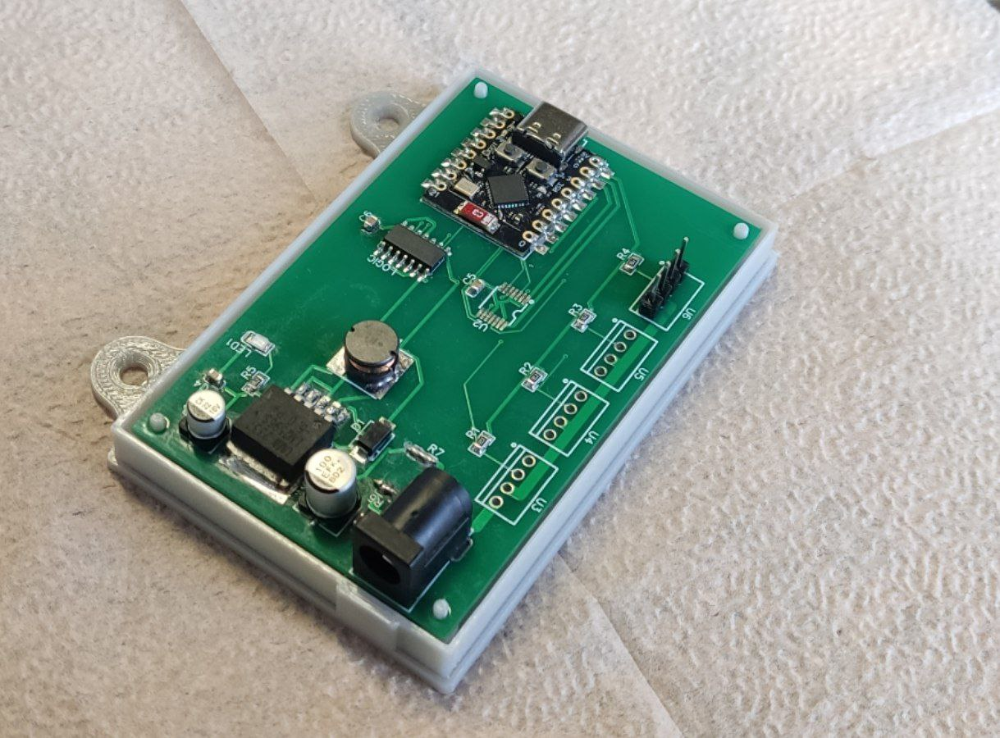

# BLE Fan Controller for Home Assistant

This project implements a controller for managing four fans via Bluetooth Low Energy (BLE) with Home Assistant integration. The controller allows you to control fan speed and receive real-time RPM data.

## Features

- Independent control of 4 fans
- Real-time RPM measurement for each fan
- PWM speed control (0-255)
- Bluetooth Low Energy (BLE) interface
- Home Assistant integration
- Support for up to 4 fans simultaneously

## Hardware Requirements

- ESP32-C3-SUPER-MINI
- 4 fans with 4-pin connection (PWM, RPM, GND)
- 12V power supply

## Connection

### Fans
- PWM signal: pins 0, 1, 2, 3
- RPM signal: pins 5, 6, 7, 8
- GND: common ground

## Installation

1. Clone this repository
2. Install required libraries in Arduino IDE:
   - NimBLE-Arduino
3. Open `home_asist_fan.ino` in Arduino IDE
4. Upload the code to your ESP32 board
5. If you encounter compilation errors, check module versions

## Configuration

### BLE Parameters
- Device name: "FanController"
- Service UUID: "12345678-1234-1234-1234-1234567890ab"
- PWM characteristics: "12345678-1234-1234-1234-1234567890ac" - "12345678-1234-1234-1234-1234567890af"
- RPM characteristics: "12345678-1234-1234-1234-1234567890b0" - "12345678-1234-1234-1234-1234567890b3"

### Fan Settings
- PWM frequency: 25 kHz
- PWM resolution: 8-bit (0-255)
- RPM update: every second

## Home Assistant Integration

1. Add BLE integration in Home Assistant
2. Find the "FanController" device
3. Configure automations for fan control

## Usage

After uploading the code:
1. Power on the controller
2. Connect to the device via BLE
3. Use PWM characteristics to control speed (0-255)
4. Read RPM characteristics to get rotation speed

## Components

### Main Components
- ESP32-C3-SUPER-MINI (U1) - main controller
- LM2596S-5.0 (U7) - 5V step-down converter
- SN74AHCT125DR (LOGIC) - signal buffer
- SN74LV125APWR (U2) - signal buffer
- 4x KF2510-4P (U3-U6) - fan connectors

### Passive Components
- Capacitors:
  - 100uF 25V (C1)
  - 22uF 16V (C2)
  - 4x 0.1uF (C3-C6)
- Resistors:
  - 5x 1k (R1-R5)
  - 2x 0 Ohm (R6-R7)
- 100uH inductor (L1)
- SS34 diode (D1)
- Green LED (LED1)

### Connectors
- DC-005-A (DC1) - power connector

## Manufacturing

### Production Files
- [Gerber files](production/Gerber_t-fun_PCB_t-fun_4_2025-05-18.zip) - for PCB manufacturing
- [BOM (Bill of Materials)](production/BOM_t-fun_2025-05-18.csv) - component list
- [3D(https://github.com/Vasilichru/3d_home_assist_fan_case) - case from wts_3d(https://t.me/wts_3d)

### Component Links
All components are available on [ChipDip](https://www.chipdip.ru/). Links to specific components are provided in the BOM file.

## Photos

### Connection Diagram

### PCB

### Assembled Device

## Contributing

You can:
- Report bugs
- Suggest improvements
- Create pull requests

## License

This project is licensed under the MIT License - see the [LICENSE](LICENSE) file for details.

